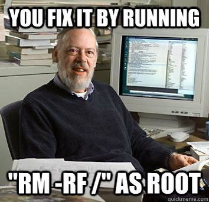

### Goals
- The trainee will understand how to handle files
- The trainee will understand how to find the location of files
- The trainee will understand what links are and how to use them

### Tasks
- Read about to following linux commands:
  - `touch`
  - `cp`
  - `mv`
  - `rm`
  - `which`
  - `locate`
  - `find`
  - `ln`
  - `basename`
  - `dirname`
- How can I create a new file?
- Which binary file executes when running the `lsb_release` command?
- Find the words file using the `find` command.
- List all the files that are bigger than 10MB inside the /boot directory.
- Using `find`, read all files that are smaller than 10KB inside the /home directory (hint: read about `-exec`).
- Read about `find`'s `-name` and `-iname` flags. What do they do? What are the differences?
- Read about inodes and explain what inodes are.
- Explain the difference between hard link and soft link.
- How can we find the inode of a specific file?
- What is the difference between find and locate?
- How can you copy an entire directory while also keeping the ownership and mode of the files?

